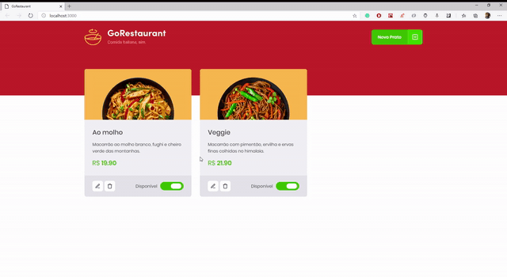

<h3 align="center">
  Desafio 10: GoRestaurant Web
</h3>

<blockquote align="center">"The time it takes to make your dreams come true will pass anyway"!</blockquote>

<p align="center">
  

  <a href="https://rocketseat.com.br">
    
  </a>

  

  <a href="https://github.com/Rocketseat/bootcamp-gostack-desafios/stargazers">
    
  </a>
</p>

<p align="center">
  <a href="#rocket-sobre-o-desafio">About the challenge</a>&nbsp;&nbsp;&nbsp;|&nbsp;&nbsp;&nbsp;
  <a href="#memo-licença">License</a>
</p>

<p align="center">
  
</p>

## :rocket: About the challenge

In this challenge, you will develop another application, GoRestaurant. Now you will practice what you have learned so far in React.js along with TypeScript, practicing the concept of CRUD (Create, Read, Update, Delete).

This will be an application that will connect to a fake API, and display the created food dishes and allow the creation, removal and updating of these dishes.

### Using a fake API

First of all, so that you have the data to display on screen, we created a file that you can use as a fake API to provide you with this data.

For that, we have installed in your package.json a dependency called `json-server`, and a file called` server.json` that contains the data for a `/ foods` route. To run this server you can run the following command:

```js
  yarn json-server server.json -p 3333
```

### Application features

Now that you have the template cloned and ready to continue, you should check the files in the `src` folder and complete where there is no code, with the code to achieve the objectives of each route.

- **`List your API's food dishes`**: Your `Dashboard` page should be able to display a listing, with the `title`,` value`, and `description` and` available` field for everyone the food dishes that are registered in your API.

- **`Add new food dishes to your API`**: On your Dashboard page, you must open a modal by clicking on the` New Dish` button in the Header. This modal must be responsible for registering a new `food` passing the` image`, `name`,` description`, `value` fields.

- **`Edit food dishes from your API`**: On your Dashboard page you must open a modal by clicking on the` Edit Dish` button. This modal should be responsible for editing a `food` by passing the` image`, `name`,` description`, `value` fields.

- **`Remove food dishes from your API`**: On your Dashboard page you must remove a food dish by clicking on the button with the trash can icon in the Food component.

- **`Change availability of food dishes from your API`**: On your Dashboard page you must change the availability of a food dish by clicking on the switch that is controlled by the value of` available`.

### Testing specification
In each text, there is a brief description of what your application must fulfill in order for the test to pass.
For this challenge, we have the following tests:

* **`should be able to list all the food plates from your api`**: For this test to pass, your application must allow all food dishes that are returned from your fake API to be listed.

- **`should be able to add a new food plate`**: For this test to pass, you must allow a plate of food to be added to your api, adding it to the list as well.

- **`should be able to edit a food plate`**: In order for this test to pass, you must allow a plate of food to be edited in your api, also editing it in the list.

- **`should be able to remove a food plate`**: For this test to pass, you must allow a plate of food to be removed from your api, also removing it from the list.

- **`should be able to update the availibility of a food plate`**: For this test to pass, on your dashboard you must allow the status of the food dish to be changed between `Available` and` Unavailable`;


## :memo: Licença

This project is under the MIT license. See the archive  [LICENSE](LICENSE).

---
